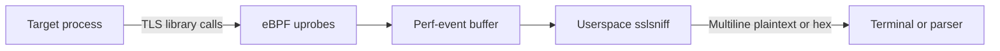

# eBPF TLS Tap

eBPF TLS Tap is DatRail's low-level Linux TLS observation component. It builds
`bpf/sslsniff`, which attaches uprobes to OpenSSL, GnuTLS, and NSS and prints
decrypted TLS traffic for inspection and downstream parsing.

## Quick start

On a Linux host with a BTF-enabled kernel:

```bash
git clone --recursive https://github.com/datrail/ebpf-tls-tap.git
cd ebpf-tls-tap
sudo apt-get install clang llvm gcc libelf-dev zlib1g-dev libssl-dev make git
make build-bpf
sudo ./bpf/sslsniff -c curl
```

Use `-p <pid>` to restrict capture to one process or `--hexdump` to print raw
payload bytes. Run `sudo ./bpf/sslsniff --help` for all options.

## Architecture



The kernel program observes TLS-library entry and return points; the userspace
loader reads events and prints a column header followed by multiline plaintext
or hexadecimal payload blocks. The repository pins the libbpf, bpftool, and
kernel type-header sources needed for reproducible builds.

## Security

This program requires elevated BPF privileges and exposes plaintext that TLS
normally protects. Restrict capture to the intended process, protect stdout and
downstream logs, and never run it on a host or workload you are not authorized
to observe. Read [SECURITY.md](SECURITY.md) and report vulnerabilities privately
through GitHub Security Advisories.

## Development

```bash
git submodule update --init --recursive
make build-bpf
```

The build and probe checks require the Linux C/eBPF toolchain; see
[`bpf/Makefile`](bpf/Makefile) and the GitHub Actions workflow for exact CI
dependencies.

## Related projects

- [RailMon](https://github.com/datrail/railmon) provides DatRail's supported
  structured capture and export path through AgentSight.
- [RailDash](https://github.com/datrail/raildash) presents structured captures.

## License

DatRail userspace source, build glue, and documentation are Apache-2.0. The
kernel eBPF program is GPL-2.0-only, and vendored upstream trees retain their
own per-file licenses. See [LICENSE](LICENSE), [LICENSES](LICENSES/), and
[NOTICE](NOTICE).
