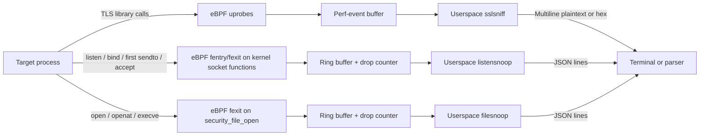

# eBPF TLS Tap

eBPF TLS Tap is DatRail's low-level Linux TLS observation component. It builds
`bpf/sslsniff`, which attaches uprobes to OpenSSL, GnuTLS, and NSS and prints
decrypted TLS traffic for inspection and downstream parsing, and
`bpf/listensnoop`, which reports every TCP, UDP or ICMP-echo socket that
starts accepting inbound traffic, and who connects to it, and
`bpf/filesnoop`, which reports the files a process opens to read, write or
run.

## Quick start

On a Linux host with a BTF-enabled kernel:

```bash
git clone --recursive https://github.com/datrail/ebpf-tls-tap.git
cd ebpf-tls-tap
sudo apt-get install clang llvm gcc libelf-dev zlib1g-dev libssl-dev make git
make build-bpf
sudo ./bpf/sslsniff -c curl
```

Use `-p <pid>` to restrict capture to one process or `--hexdump` to print raw
payload bytes. Run `sudo ./bpf/sslsniff --help` for all options.

## Listening sockets

An agent that opens a local port is offering a service nobody declared — a
covert channel no TLS call ever reveals. `listensnoop` reports each TCP, UDP
or ICMP-echo socket that starts accepting inbound traffic, as it appears, and
each new remote address a TCP listener accepts a connection from:

```bash
sudo ./bpf/listensnoop            # or -p <pid> / -u <uid>
```

```json
{"timestamp_ns":76326320956582,"kind":"listen","pid":4211,"tid":4211,"host_pid":2957315,"uid":1000,"comm":"python3","protocol":"tcp","family":"ipv4","addr":"127.0.0.1","port":38135,"ephemeral":true}
```

```json
{"timestamp_ns":97926295426156,"kind":"peer","pid":4211,"tid":4211,"host_pid":2957315,"uid":1000,"comm":"python3","protocol":"tcp","family":"ipv4","addr":"127.0.0.1","port":38135,"ephemeral":true,"peer":"127.0.0.5"}
```

One JSON object per line, one line per socket or new peer:

- `"kind":"listen"`: a TCP socket entered LISTEN (`inet_csk_listen_start`).
  A repeated `listen()` that only resizes the backlog is not reported again.
- `"kind":"bind"`: a UDP socket bound a local port (`inet_bind`,
  `inet6_bind`). UDP has no `listen()`, so this is the only signal a UDP server
  gives. An unprivileged ICMP "ping" socket (`SOCK_DGRAM`, not raw) is
  reported the same way, with `protocol` `icmp`/`icmpv6` and its echo
  identifier as `port`: it receives every echo reply carrying that
  identifier. TCP binds are not reported; a TCP socket that never listens is
  a client.
- `"kind":"autobind"`: an unbound UDP or ping socket's first `sendto()` bound
  it (`inet_send_prepare`). Unconnected, it now receives from anyone. This also
  covers a bind made with `IP_BIND_ADDRESS_NO_PORT`, which gets its port here.
  A `connect()` is not reported, since a connected socket only hears its peer.
- `"kind":"peer"`: a process accepted a TCP connection from a remote address
  (`inet_csk_accept`, which every `accept()`, `accept4()` and io_uring accept
  reaches) for the first time on that listener. `addr`, `port`,
  `family` and `ephemeral` are the listener's, so a peer joins to the
  `listen` event it belongs to; `peer` is the remote address, with an IPv4
  client of a dual-stack IPv6 listener written as plain IPv4. The kernel
  remembers which (process, listener, peer) it has reported, so a busy server
  costs one event per new peer, not one per connection. A process is its
  host PID, start time and exec count, so a reused PID or an `exec()` starts
  afresh, while threads with their own names count as one process. That memory is a 16,384-entry LRU: past that, an old peer can be
  reported again. A connection nobody accepts is not reported, and neither
  are UDP senders (UDP has no accept) or MPTCP joins (a later subflow,
  possibly from another address, added to an accepted connection without
  another accept). Behind NAT or a proxy, `peer`
  is the last hop (for a Docker published port with the userland proxy, the
  bridge gateway), not the original client.
- `"kind":"lost","count":N`: up to N events were missed. The count includes
  events the ring buffer had no room for, and calls the kernel skipped
  because the same program was already running on that CPU (its
  `recursion_misses`). The second kind can be caused deliberately by an
  unprivileged process. The count is an upper bound, since a skipped call
  might not have produced an event. It appears within a poll interval, even
  if no event follows it, so a flood cannot hide one `listen()` silently.
  Treat a gap as "unknown", not "no change". Skips are counted host-wide,
  whatever `-p`/`-u` say, so any process can inflate the count. That is
  noisy, but it is not silent.
- Address and port are read after the kernel assigned them, so a bind to port
  0, or a `listen()` with no `bind()`, reports the port actually chosen.
- `ephemeral` is true when the kernel chose the socket's current port: its
  latest bind asked for port 0, or it was unbound when `listen()` started, or
  it was an autobind. A socket that releases a chosen port and then binds
  one it asks for reads `false`. Such a port
  differs on every run. A port the caller asked for is the service's
  identity, whatever range it falls in, so compare listeners on
  `ephemeral` rather than guessing from the number.
- Failed calls produce nothing.
- `pid`, `tid` and `-p` use the numbering of `listensnoop`'s own PID namespace.
  On the host, a containerised agent gets its host PID. Inside a container you
  get the PIDs you see there, and a process outside the container's namespace
  has `pid` 0 and only `host_pid`. `uid` is the kernel's (initial user
  namespace) view.
- `-n` (`--own-namespace`) leaves processes listensnoop's PID namespace
  cannot see out, in the kernel, instead of reporting them with `pid` 0. Run
  in an agent's namespace, it records that namespace and any nested in it.
- Each attach prints `{"kind":"start","time":...,"every":N,"peers":true}`;
  `peers` says this version reports `peer` events, so a consumer can tell
  "nobody connected" from a probe too old to report it. `-H SECONDS`
  (`--heartbeat`) adds an `alive` line of the same shape about every N
  seconds, scheduled on the monotonic clock and stamped in wall-clock UTC.
  A consumer can then tell a quiet probe from a stopped one, and see a
  restart: the probe does not report sockets already listening when it
  attaches, so anything opened while it was down is missing. A process that
  shares the probe's PID namespace can signal it, so these records matter
  there.
- Not covered:
  - sockets already listening when it starts (read `/proc/net/{tcp,udp}{,6}`
    for those);
  - SCTP;
  - raw and packet sockets;
  - additional MPTCP subflows (joins) and UDP senders, as peers;
  - IPv6 UDP binds when IPv6 is a module that is not loaded (it warns on
    stderr).

It needs BTF and fentry/fexit: Linux 5.17 or newer on x86-64, 6.0 on arm64.
All hooks are fentry/fexit, so concurrent calls cannot exhaust return-probe
slots the way kretprobes can. Events go to their own 1 MiB BPF ring buffer,
separate from sslsniff's.

Measured on a 7.3 kernel:
- about 0.9 µs added per `listen()`/`bind()` call;
- about 0.3 µs added per accepted TCP connection (11.2 µs against 10.9 for a
  loopback connect/accept/close);
- about 28 ns (3%) added per `sendmsg()` on any inet socket, because the
  autobind hook sits on the send path;
- 80,000 events in a tight loop with none lost;
- 300 binds under 400 threads contending on `bind()`, all reported.

`tests/listensnoop_test.py` runs in CI and checks the exact event set against
real sockets: TCP, UDP and ICMP, IPv4 and IPv6, a nested PID namespace,
native-thread contention, CPU oversubscription and a stalled reader, plus
accepted peers (repeats, eight threads accepting one peer at once, a
dual-stack listener, an unaccepted connection).

## File opens

An agent's tool calls say which files it *asked* to read or write; what it
actually opened is the kernel's to say. An agent that reads `~/.ssh/id_rsa`
through a shell command, or rewrites a file outside its workspace, does it with
`open()`. `filesnoop` reports the first time each process opens each regular
file for each kind of access:

```bash
sudo ./bpf/filesnoop              # or -p <pid> / -u <uid> / -n
```

```json
{"timestamp_ns":184342893154352,"kind":"open","pid":8468,"tid":8468,"host_pid":2831976,"uid":0,"comm":"bash","path":"/tmp/fs/d/w.txt","read":false,"write":true,"exec":false,"creat":true,"trunc":true,"append":false,"dev":"0:925","ino":82066872}
```

- One line per (process, file, access). `read`, `write` and `exec` say how it
  was opened; `O_RDWR` is one line with both. Opening the file the same way
  again prints nothing; opening it another way prints again. A process is its
  host PID, start time and exec count, as for listensnoop's peers. The file
  is the path it was opened by plus its inode, so a hard link or bind mount
  reads as its own path. That memory is a 65,536-entry LRU: past that, an
  old file can be reported again.
- The hook is `security_file_open`, on return, so only opens the LSMs allowed
  are reported, from `open()`, `openat()`, `openat2()`, io_uring and
  `execve()` alike. `exec` marks the program `execve()` runs, and then the
  ELF interpreter the kernel opens for it.
- `creat`, `trunc` and `append` are the flags the caller passed. `O_CREAT` on
  a file that already exists creates nothing.
- `path` is what the process would see: it is resolved against the opener's
  root, so a container's `/etc/passwd` reads as `/etc/passwd`. An unlinked
  file's path ends in ` (deleted)`, as in `/proc/<pid>/fd`. A path that is
  not UTF-8 prints each invalid byte as U+FFFD and adds `path_hex`, the exact
  bytes. If the kernel can't produce the path, `path` is empty and
  `path_error` holds the error.
- overlayfs opens files in its layers on the opener's behalf: the file
  beneath the one the process asked for, and the lower file when a write
  copies it up. Those opens happen on a private mount of the layer. For an
  overlay mounted from the initial user namespace, which is how a container
  runtime mounts a container's root, they are skipped while the process's
  own open is in progress: they are that open, under a path the process never
  named. Any other open on such a mount is reported with `"layer":true`.
  There, `path` is relative to the layer, and `dev` and `ino` are the file
  actually read or written. That is how an unprivileged process that mounts
  its own overlay, in a user namespace, over a directory it can read still
  shows which file it read. Rootless container runtimes mount that way too,
  so their containers' first opens come with layer events.
- `-p`, `-u`, `-n`, `-H`, the `start`/`alive` records and `lost` work as for
  listensnoop. filesnoop's own opens are left out.
- Not covered:
  - files already open when it starts, and reads or writes through a
    descriptor opened before then or passed in from another process;
  - directories, devices, FIFOs and sockets;
  - `O_PATH` opens (they can't read or write), and calls that act on a
    path without opening it: `truncate(2)` (which can empty a file),
    `stat`, `rename`, `unlink`, `chmod`;
  - `mmap` of a file already open.

Opens are frequent: unfiltered on a busy host it prints thousands of lines a
second (every process loading its libraries counts), so give it `-p`, `-u`
or `-n` where you can. Measured on a 7.3 kernel, a repeated `open()`/`close()`
of one file costs about 0.2 µs more with it attached (0.81 µs against 0.60).
Events are variable-length, in a 4 MiB ring buffer of its own.

`tests/filesnoop_test.py` runs in CI and checks the exact event set: each
access once however often or concurrently repeated, the open flags, exec and
its interpreter, the silent cases (a directory, a device, `O_PATH`, a failed
open), a non-UTF-8 name, an overlay a runtime mounted (no layer events, a
copy-up included), an overlay mounted in a user namespace (the layer file
reported), `-p`, and a stalled reader whose gap must be counted.

## Architecture


```mermaid
flowchart LR
  process[Target process] -->|TLS library calls| bpf[eBPF uprobes]
  bpf --> events[Perf-event buffer]
  events --> sslsniff[Userspace sslsniff]
  sslsniff -->|Multiline plaintext or hex| output[Terminal or parser]
  process -->|listen / bind / first sendto / accept| kfn[eBPF fentry/fexit on kernel socket functions]
  kfn --> ring[Ring buffer + drop counter]
  ring --> listensnoop[Userspace listensnoop]
  listensnoop -->|JSON lines| output
  process -->|open / openat / execve| ffn[eBPF fexit on security_file_open]
  ffn --> fring[Ring buffer + drop counter]
  fring --> filesnoop[Userspace filesnoop]
  filesnoop -->|JSON lines| output
```

sslsniff's kernel program observes TLS-library entry and return points; its
loader reads events and prints a column header followed by multiline plaintext
or hexadecimal payload blocks. The repository pins the libbpf, bpftool, and
kernel type-header sources needed for reproducible builds.

## Security

These programs require elevated BPF privileges. sslsniff exposes plaintext
that TLS normally protects; listensnoop reads no payload, only socket
addresses (including the addresses of clients that connect), process names
and IDs; filesnoop reads no file content, but file paths can themselves be
sensitive (a user's home directory, a project's name). Restrict capture to the intended process,
protect stdout and downstream logs, and never run either on a host or workload
you are not authorized to observe. Read [SECURITY.md](SECURITY.md) and report vulnerabilities privately
through GitHub Security Advisories.

## Development

```bash
git submodule update --init --recursive
make build-bpf
sudo python3 tests/listensnoop_test.py   # listensnoop end to end (needs cc, python3)
sudo python3 tests/filesnoop_test.py     # filesnoop end to end (needs python3, mount, unshare)
```

The build and probe checks require the Linux C/eBPF toolchain; see
[`bpf/Makefile`](bpf/Makefile) and the GitHub Actions workflow for exact CI
dependencies.

## Related projects

- [RailMon](https://github.com/datrail/railmon) provides DatRail's supported
  structured capture and export path through AgentSight.
- [RailDash](https://github.com/datrail/raildash) presents structured captures.

## License

DatRail userspace source, build glue, and documentation are Apache-2.0. The
kernel eBPF programs (`bpf/*.bpf.c`) are GPL-2.0-only, and vendored upstream trees retain their
own per-file licenses. See [LICENSE](LICENSE), [LICENSES](LICENSES/), and
[NOTICE](NOTICE).
